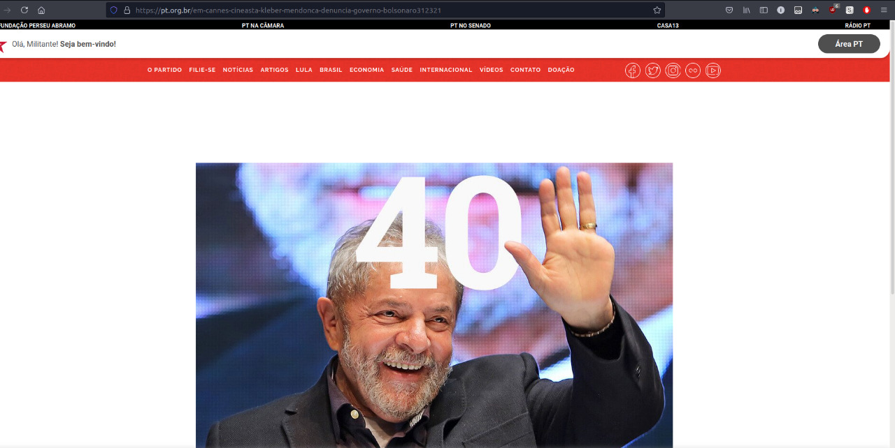
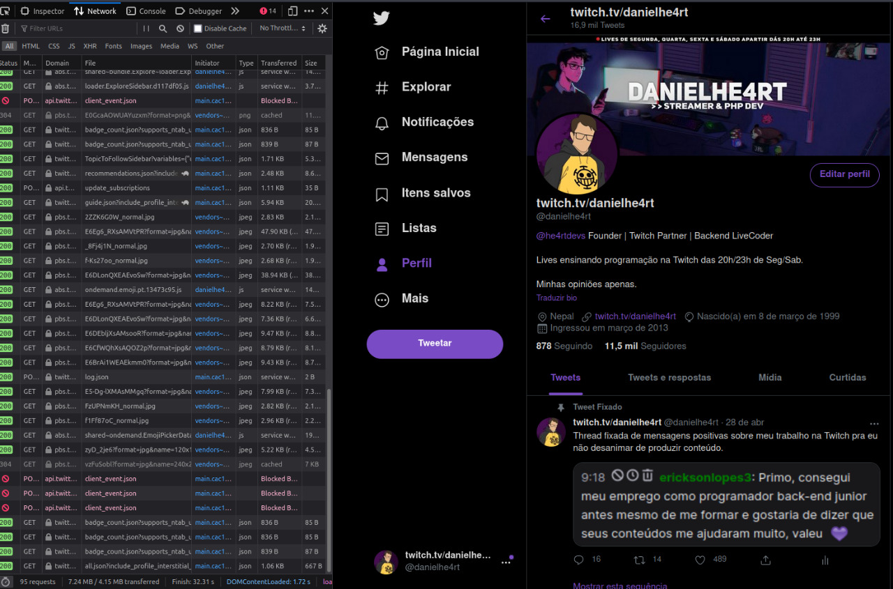

# 3.1 Códigos HTTP

Se você já usou a internet alguma vez é quase que certeza que já apareceu algum meme ou algo relacionado a 404. Recentemente houve uma operação da policia federal com esse nome e eu achei sensacional pelo o que foi proposto. Se quiser matar essa curiosidade também, [clique aqui](https://g1.globo.com/df/distrito-federal/noticia/2021/07/08/ministerio-da-justica-faz-operacao-contra-pirataria-digital-em-9-estados.ghtml).

Se você notar, todo site tem uma pagina 404 e muitos tem sacadas geniais e a que eu mais gosto é a do site do PT. Isso mesmo! A melhor representação que eu já achei desse código HTTP é no site do PT. Se liga:

<h1 align="center"></h1>

Mas, o que signifca 404? Isso mesmo brasileirinho, significa NOT FOUND (não encontrado).

A importância de retornar o Status HTTP correto para o Browser é realmente ditar o que está acontecendo e como ele deve se comportar. Se você tenta acessar uma URL inexistente dentro do site do PT, você vai dar de cara com o Kraken 404 pois essa pagina não existe e há uma preparação para isso.

Existem uma série de Códigos HTTP que você pode estar aprendendo, mas vamos entender sobre o que a base de cada número significa:

- Respostas de Informação: 100 - 199
- Respostas de Sucesso: 200 - 299
- Redirecionamentos: 300 - 399
- Erros do Cliente: 400 - 499
- Erros do Servidor: 500 - 599

Se você observar bem o 404 se encaixa na categoria de Erros do Cliente, já que você (cliente) tentou acessar algo inexistente.

Quando nós acessamos qualquer site, se formos na aba Network vamos ter uma noção maior do que tá rolando e vamos ter uma visão de Códigos HTTP que tá rolando por baixo dos panos. Acessa seu Twitter ai, no seu perfil, e dá uma olhada e vê se parece algo com isso:

<h1 align="center"></h1>

Podemos identificar em VERDE respostas de sucesso, e ali ele está carregando todo o HTML/CSS/JS e fazendo requisições pro servidor que responde OK (200) para o nosso cliente.

Agora, se criarmos um tweet, ele deverá retornar o código CREATED (201) para a requisição feita. Isso é um padrão, e deveria ser seguido sempre.

Mas ai você me pergunta: AAHH Daniel mas no meu trabalho eles usam 200 pra tudo e trata no Front-end. Isso funciona né?

Técnicamente, funciona. Mas é uma péssima prática que condena o software a longo prazo. Se existem códigos que são padronizados para usos especificos, devemos usar e é isso. 

- Se você quer consultar algo: 200 (OK)
- Se você cria um registro: 201 (Created)
- Se você faz uma requisição que não volta NADA: 204 (No Content)
- Se você é barrado por não estar autenticado: 401 (Unauthorized)
- Se você está autenticado mas não pode acessar tal área: 403 (Forbidden)
- Se você é barrado por estar mandando dados errados pro back-end: 422 (Unprocessable Entity)
- Se deu MERDA FUDEU TUDO no lado do servidor: 500 (Internal Server Error)

Existem vários códigos HTTP's que podem ser usados no seu projeto e se mesmo depois desse post você continuar fazendo cagada nos projetos eu ~~vou te moer na porrada~~ ficar triste contigo =/

